# Godamm - Inventory Management System

A production-ready, full-stack inventory management platform built with **Spring Boot** and **React (Vite/TypeScript)**. Features secure JWT authentication with email OTP verification, multi-tenant data isolation, Redis caching, and automated CI/CD deployment to AWS EC2.

> **Live**: [godamm.mraks.dev](https://godamm.mraks.dev) · [godamm.anjaliv.dev](https://godamm.anjaliv.dev)  
> **API**: [api.godamm.mraks.dev](https://api.godamm.mraks.dev)  
> **Source**: [github.com/AnjaliViswakarma-08/GoDamm](https://github.com/AnjaliViswakarma-08/GoDamm)

---

## Table of Contents

- [Tech Stack](#tech-stack)
- [Features](#features)
- [System Architecture](#system-architecture)
- [Data Flow Diagrams (DFD)](#data-flow-diagrams-dfd)
  - [Level 0 — Context Diagram](#level-0--context-diagram)
  - [Level 1 — Subsystem Decomposition](#level-1--subsystem-decomposition)
  - [Level 2 — Process Decomposition](#level-2--process-decomposition)
- [Flow Control Diagrams](#flow-control-diagrams)
  - [User Registration & OTP Verification Flow](#user-registration--otp-verification-flow)
  - [User Login Flow](#user-login-flow)
  - [Forgot Password Recovery Flow](#forgot-password-recovery-flow)
  - [Product CRUD Flow](#product-crud-flow)
  - [Supplier CRUD Flow](#supplier-crud-flow)
  - [Sell Product Flow (Atomic Transaction)](#sell-product-flow-atomic-transaction)
  - [API Request Authentication Flow (JWT Filter)](#api-request-authentication-flow-jwt-filter)
  - [CI/CD Deployment Flow](#cicd-deployment-flow)
  - [Cache Read/Write Flow](#cache-readwrite-flow)
- [Class Diagram](#class-diagram)
  - [Domain Entity Class Diagram](#domain-entity-class-diagram)
  - [Service Layer Class Diagram](#service-layer-class-diagram)
  - [Controller Layer Class Diagram](#controller-layer-class-diagram)
  - [Security & Config Class Diagram](#security--config-class-diagram)
- [Interaction Diagrams (Sequence)](#interaction-diagrams-sequence)
  - [User Registration Sequence](#user-registration-sequence)
  - [Login & JWT Issuance Sequence](#login--jwt-issuance-sequence)
  - [Sell Product Sequence (Atomic Stock Decrement)](#sell-product-sequence-atomic-stock-decrement)
  - [Product Creation Sequence](#product-creation-sequence)
  - [Forgot Password Reset Sequence](#forgot-password-reset-sequence)
- [Collaboration Diagrams](#collaboration-diagrams)
  - [Authentication Subsystem Collaboration](#authentication-subsystem-collaboration)
  - [Inventory Management Collaboration](#inventory-management-collaboration)
  - [Sale Processing Collaboration](#sale-processing-collaboration)
- [Repository Structure](#repository-structure)
- [Installation & Setup](#installation--setup)
- [Environment Variables](#environment-variables)
- [Database Design](#database-design)
  - [Entity Relationship Model](#entity-relationship-model)
  - [Key Design Decisions](#key-design-decisions)
- [Deployment Architecture](#deployment-architecture)
  - [Infrastructure Overview](#infrastructure-overview)
  - [Quick Deploy on EC2](#quick-deploy-on-ec2)
  - [CI/CD (GitHub Actions)](#cicd-github-actions)
- [Security Hardening](#security-hardening)
- [License](#license)

---

## Tech Stack

| Layer | Technologies |
|---|---|
| **Frontend** | React 18, TypeScript, Vite, Tailwind CSS, Framer Motion |
| **Backend** | Java 17, Spring Boot 3, Spring Security, Spring Data JPA, Flyway |
| **Database** | MySQL 8, Redis 7 (cache) |
| **Auth** | JWT (Bearer Token), BCrypt, Email OTP (Java Mail / SMTP) |
| **DevOps** | Docker, Docker Compose, GitHub Actions, Nginx, Certbot, AWS EC2 |
| **Frontend Hosting** | Vercel |

---

## Features

- 🔐 **Secure Authentication** — Email registration/login with BCrypt hashing and JWT sessions
- 📧 **OTP Verification** — 6-digit email OTP for registration and password recovery
- 🏪 **Multi-Tenant Isolation** — All inventory data is scoped per authenticated user
- 📦 **Product Management** — Full CRUD with supplier linkage and stock tracking
- 🚚 **Supplier Management** — CRUD with referential integrity protection
- 💰 **Sell Functionality** — Atomic stock decrement preventing double-sell race conditions
- 📊 **Dashboard Analytics** — Real-time profit tracking, low-stock alerts, inventory charts
- ⚡ **Redis Caching** — User-scoped read caching with write-through eviction
- 🚀 **Automated CI/CD** — GitHub Actions → Docker Hub → EC2 deploy pipeline

---

## System Architecture

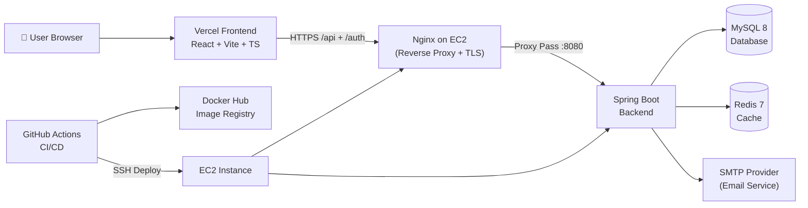

---

## Data Flow Diagrams (DFD)

### Level 0 — Context Diagram

The entire system as a single process with external entities.

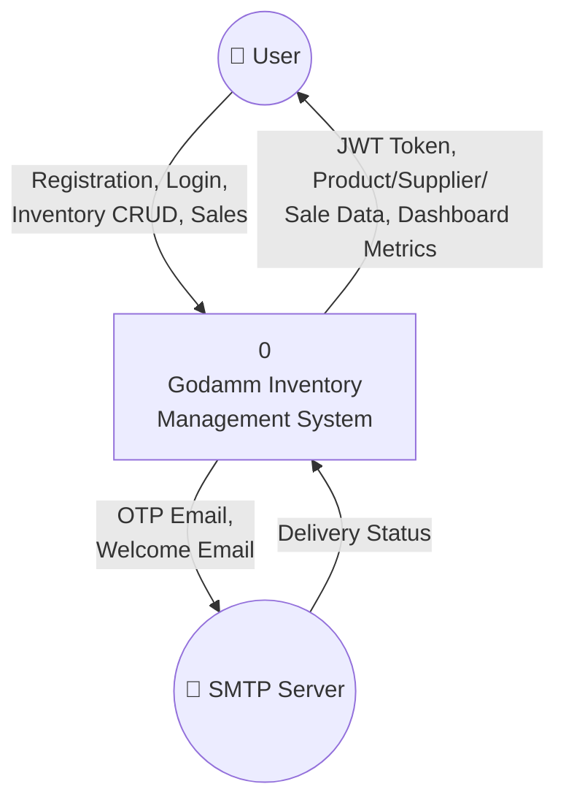

### Level 1 — Subsystem Decomposition

Breaking down into major processing subsystems.

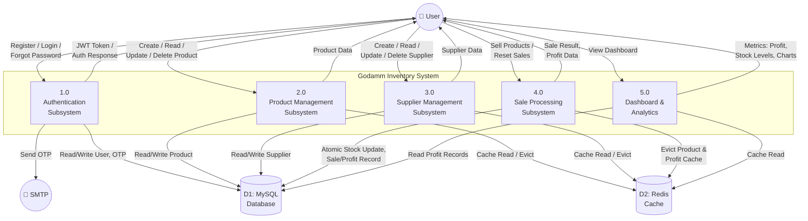

### Level 2 — Process Decomposition

Expanding the **Authentication Subsystem (1.0)** and the **Sale Processing Subsystem (4.0)** into granular processes.

#### 2A — Authentication Subsystem Decomposition

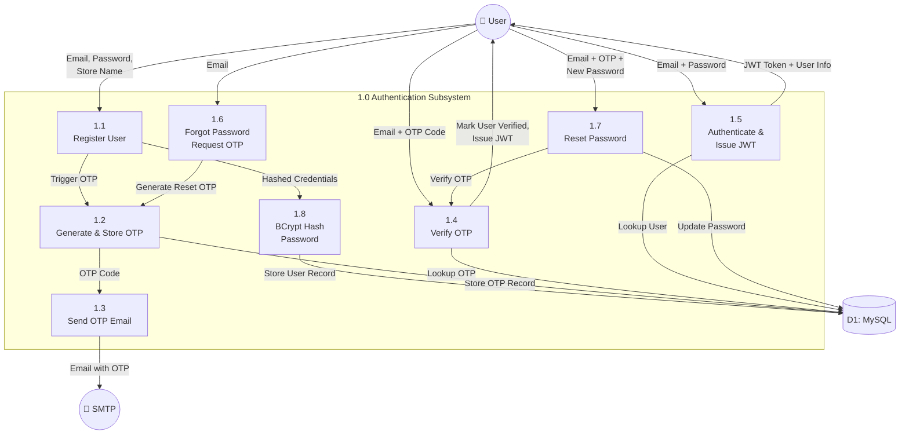

#### 2B — Sale Processing Subsystem Decomposition

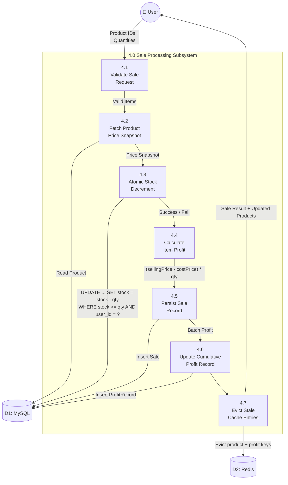

---

## Flow Control Diagrams

### User Registration & OTP Verification Flow

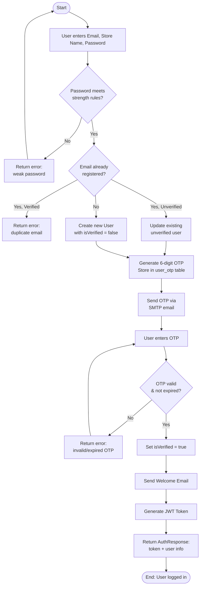

### User Login Flow

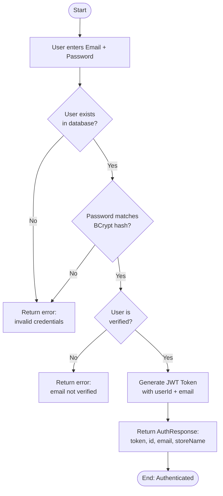

### Forgot Password Recovery Flow

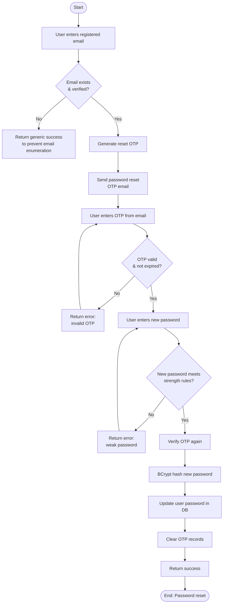

### Product CRUD Flow

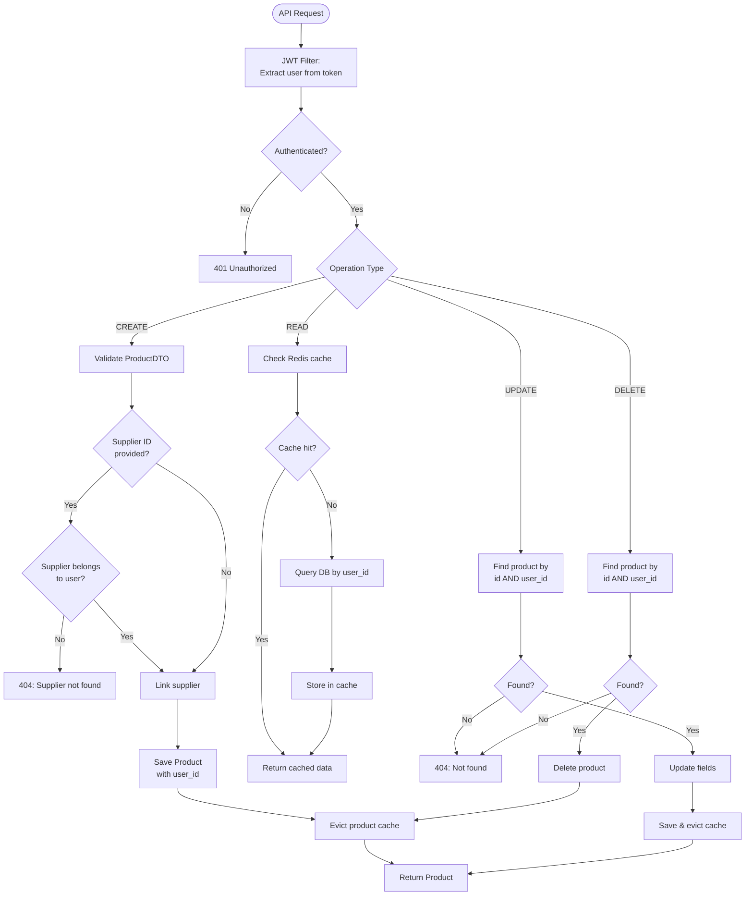

### Supplier CRUD Flow

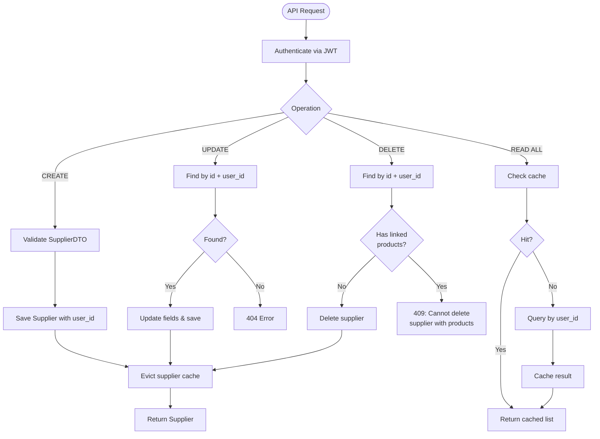

### Sell Product Flow (Atomic Transaction)

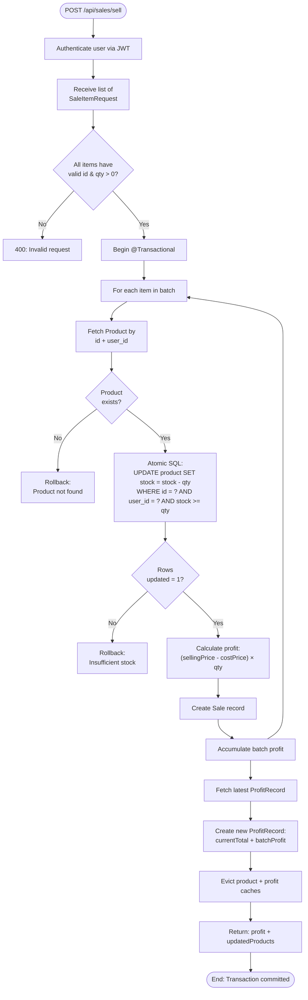

### API Request Authentication Flow (JWT Filter)

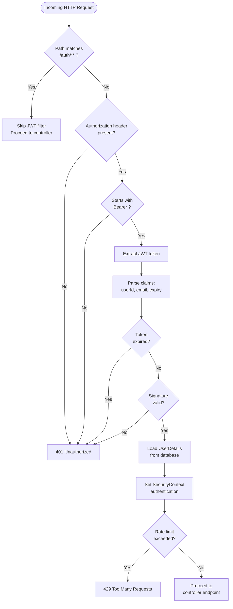

### CI/CD Deployment Flow

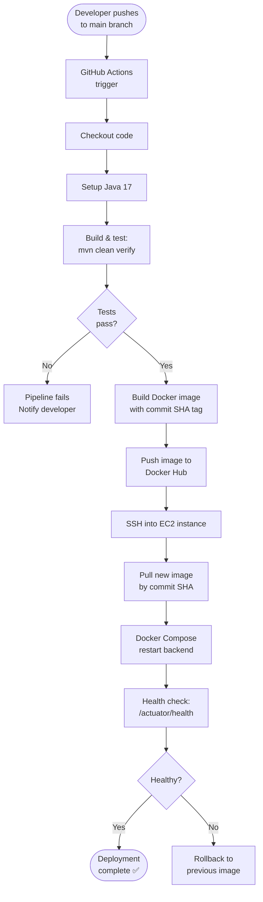

### Cache Read/Write Flow

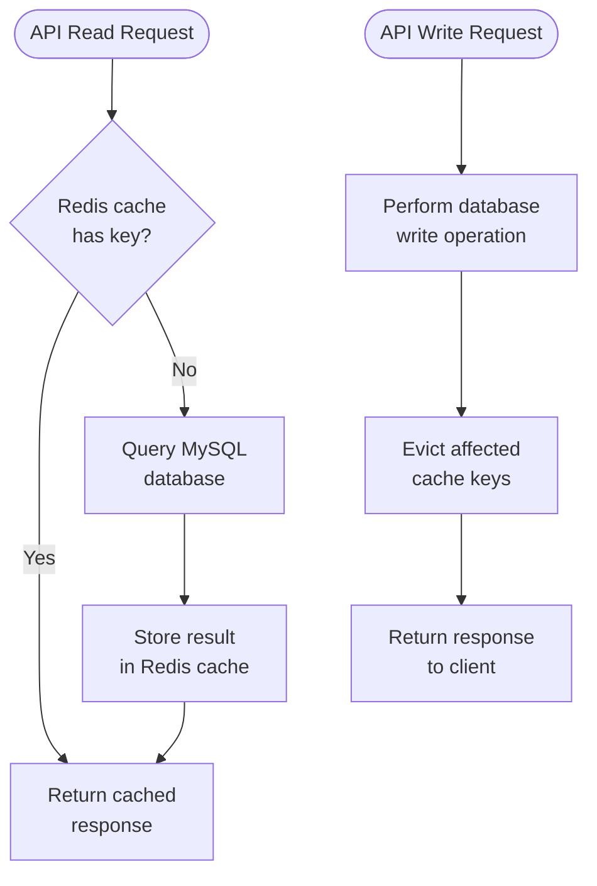

---

## Class Diagram

### Domain Entity Class Diagram

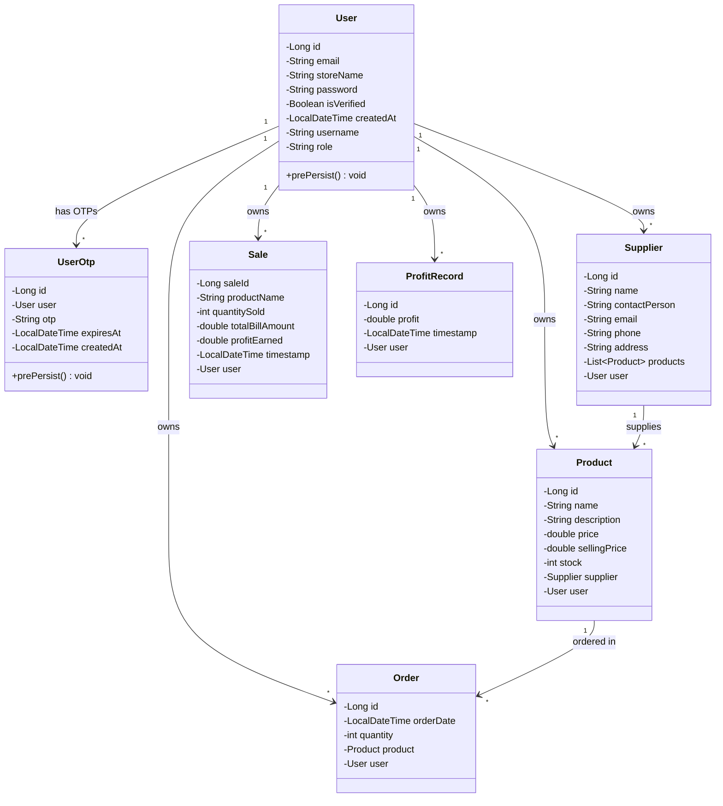

### Service Layer Class Diagram

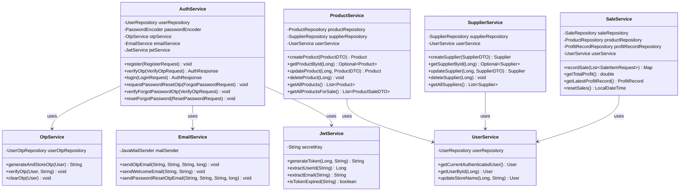

### Controller Layer Class Diagram

```mermaid
classDiagram
    class AuthController {
        -AuthService authService
        +register(RegisterRequest) ResponseEntity
        +verifyOtp(VerifyOtpRequest) ResponseEntity
        +login(LoginRequest) ResponseEntity
        +requestPasswordResetOtp(ForgotPasswordRequest) ResponseEntity
        +verifyForgotPasswordOtp(VerifyOtpRequest) ResponseEntity
        +resetForgotPassword(ResetPasswordRequest) ResponseEntity
    }

    class ProductController {
        -ProductService productService
        +createProduct(ProductDTO) ResponseEntity
        +getProductById(Long) ResponseEntity
        +updateProduct(Long, ProductDTO) ResponseEntity
        +deleteProduct(Long) ResponseEntity
        +getAllProducts() ResponseEntity
    }

    class SupplierController {
        -SupplierService supplierService
        +createSupplier(SupplierDTO) ResponseEntity
        +getSupplierById(Long) ResponseEntity
        +updateSupplier(Long, SupplierDTO) ResponseEntity
        +deleteSupplier(Long) ResponseEntity
        +getAllSuppliers() ResponseEntity
    }

    class SaleController {
        -SaleService saleService
        +sellProducts(List~SaleItemRequest~) ResponseEntity
        +getTotalProfit() ResponseEntity
        +getLatestProfitRecord() ResponseEntity
        +resetSales() ResponseEntity
    }

    class OrderController {
        -OrderService orderService
        +createOrder(OrderDTO) ResponseEntity
        +getOrders() ResponseEntity
    }

    class UserController {
        -UserService userService
        +getUser(Long) ResponseEntity
        +updateStoreName(Long, String) ResponseEntity
    }

    AuthController --> AuthService
    ProductController --> ProductService
    SupplierController --> SupplierService
    SaleController --> SaleService
    OrderController --> OrderService
    UserController --> UserService
```

### Security & Config Class Diagram

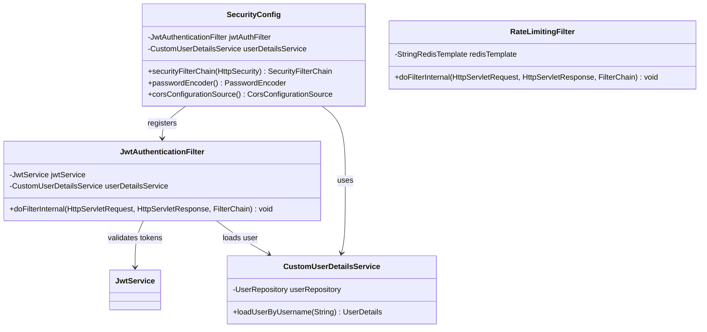

---

## Interaction Diagrams (Sequence)

### User Registration Sequence

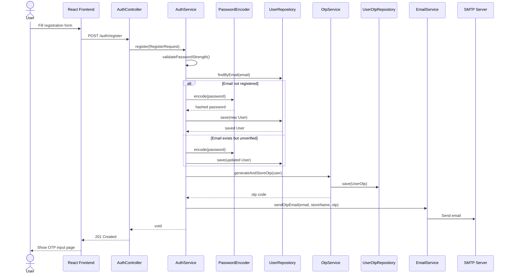

### Login & JWT Issuance Sequence

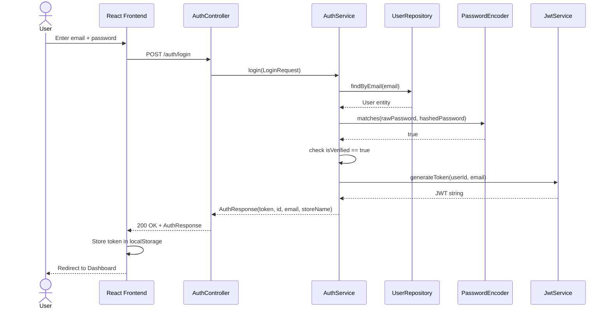

### Sell Product Sequence (Atomic Stock Decrement)

```mermaid
sequenceDiagram
    actor User
    participant UI as React Frontend
    participant SC as SaleController
    participant SS as SaleService
    participant US as UserService
    participant PR as ProductRepository
    participant SR as SaleRepository
    participant PFR as ProfitRecordRepository
    participant Cache as Redis Cache

    User->>UI: Select products & quantities
    UI->>SC: POST /api/sales/sell [SaleItemRequest[]]
    SC->>SS: recordSale(items)
    SS->>US: getCurrentAuthenticatedUser()
    US-->>SS: User entity

    loop For each SaleItemRequest
        SS->>PR: findByIdAndUserId(productId, userId)
        PR-->>SS: Product (price snapshot)
        SS->>PR: decrementStockForUser(id, userId, qty)
        Note over PR: UPDATE product<br/>SET stock = stock - qty<br/>WHERE id=? AND user_id=?<br/>AND stock >= qty
        PR-->>SS: rowsUpdated (1 = success)
        SS->>SS: Calculate profit = (sellingPrice - costPrice) × qty
        SS->>SR: save(Sale record)
    end

    SS->>PFR: findTopByUserIdOrderByTimestampDesc(userId)
    PFR-->>SS: latest ProfitRecord
    SS->>PFR: save(new ProfitRecord with accumulated profit)
    SS->>Cache: Evict product + profit cache keys
    SS-->>SC: Map{profit, updatedProducts}
    SC-->>UI: 200 OK + result
    UI-->>User: Show updated stock & profit
```

### Product Creation Sequence

```mermaid
sequenceDiagram
    actor User
    participant UI as React Frontend
    participant PC as ProductController
    participant PS as ProductService
    participant US as UserService
    participant SR as SupplierRepository
    participant PR as ProductRepository
    participant Cache as Redis Cache

    User->>UI: Fill product form
    UI->>PC: POST /api/products
    PC->>PS: createProduct(ProductDTO)
    PS->>US: getCurrentAuthenticatedUser()
    US-->>PS: User entity
    alt Supplier ID provided
        PS->>SR: findByIdAndUserId(supplierId, userId)
        SR-->>PS: Supplier entity
    end
    PS->>PR: save(Product)
    PR-->>PS: saved Product
    PS->>Cache: Evict product cache for user
    PS-->>PC: Product
    PC-->>UI: 200 OK + Product
    UI-->>User: Show updated product list
```

### Forgot Password Reset Sequence

```mermaid
sequenceDiagram
    actor User
    participant UI as React Frontend
    participant AC as AuthController
    participant AS as AuthService
    participant UR as UserRepository
    participant OS as OtpService
    participant ES as EmailService
    participant PE as PasswordEncoder

    User->>UI: Enter email on Forgot Password page
    UI->>AC: POST /auth/forgot-password/request
    AC->>AS: requestPasswordResetOtp(request)
    AS->>UR: findByEmail(email)
    AS->>OS: generateAndStoreOtp(user)
    AS->>ES: sendPasswordResetOtpEmail(email, storeName, otp)
    AS-->>AC: void
    AC-->>UI: 200 OK (generic message)
    UI-->>User: Show OTP input

    User->>UI: Enter OTP
    UI->>AC: POST /auth/forgot-password/verify-otp
    AC->>AS: verifyForgotPasswordOtp(request)
    AS->>OS: verifyOtp(user, otp)
    AC-->>UI: 200 OK
    UI-->>User: Show New Password form

    User->>UI: Enter new password
    UI->>AC: POST /auth/forgot-password/reset
    AC->>AS: resetForgotPassword(request)
    AS->>OS: verifyOtp(user, otp)
    AS->>AS: validatePasswordStrength(newPassword)
    AS->>PE: encode(newPassword)
    AS->>UR: save(user with new password)
    AS->>OS: clearOtp(user)
    AC-->>UI: 200 OK
    UI-->>User: Redirect to Login
```

---

## Collaboration Diagrams

### Authentication Subsystem Collaboration

```mermaid
flowchart TB
    subgraph "Authentication Subsystem"
        AC["AuthController\n«controller»"]
        AS["AuthService\n«service»"]
        OS["OtpService\n«service»"]
        ES["EmailService\n«service»"]
        JWT["JwtService\n«service»"]
        PE["BCryptPasswordEncoder\n«component»"]
        UR["UserRepository\n«repository»"]
        OTR["UserOtpRepository\n«repository»"]

        AC -->|"1: register(req)"| AS
        AC -->|"2: login(req)"| AS
        AC -->|"3: verifyOtp(req)"| AS
        AC -->|"4: forgotPassword(req)"| AS

        AS -->|"5: encode(password)"| PE
        AS -->|"6: findByEmail()"| UR
        AS -->|"7: save(user)"| UR
        AS -->|"8: generateAndStoreOtp()"| OS
        AS -->|"9: sendOtpEmail()"| ES
        AS -->|"10: generateToken()"| JWT

        OS -->|"11: save(otp)"| OTR
        OS -->|"12: findByUser()"| OTR
    end
```

### Inventory Management Collaboration

```mermaid
flowchart TB
    subgraph "Inventory Management Subsystem"
        PC["ProductController\n«controller»"]
        SC["SupplierController\n«controller»"]
        PS["ProductService\n«service»"]
        SS["SupplierService\n«service»"]
        US["UserService\n«service»"]
        PR["ProductRepository\n«repository»"]
        SR["SupplierRepository\n«repository»"]
        CACHE["Redis Cache\n«cache store»"]

        PC -->|"1: CRUD operations"| PS
        SC -->|"2: CRUD operations"| SS

        PS -->|"3: getCurrentUser()"| US
        SS -->|"4: getCurrentUser()"| US

        PS -->|"5: findAll/save/delete"| PR
        PS -->|"6: findByIdAndUserId()"| SR
        SS -->|"7: findAll/save/delete"| SR

        PS -->|"8: @Cacheable read"| CACHE
        PS -->|"9: @CacheEvict write"| CACHE
        SS -->|"10: @Cacheable read"| CACHE
        SS -->|"11: @CacheEvict write"| CACHE
    end
```

### Sale Processing Collaboration

```mermaid
flowchart TB
    subgraph "Sale Processing Subsystem"
        SLC["SaleController\n«controller»"]
        SLS["SaleService\n«service»"]
        US["UserService\n«service»"]
        PR["ProductRepository\n«repository»"]
        SLR["SaleRepository\n«repository»"]
        PFR["ProfitRecordRepository\n«repository»"]
        CACHE["Redis Cache\n«cache store»"]

        SLC -->|"1: sellProducts(items)"| SLS
        SLC -->|"2: getTotalProfit()"| SLS
        SLC -->|"3: resetSales()"| SLS

        SLS -->|"4: getCurrentUser()"| US
        SLS -->|"5: findByIdAndUserId()"| PR
        SLS -->|"6: decrementStockForUser()\n[atomic SQL]"| PR
        SLS -->|"7: save(Sale)"| SLR
        SLS -->|"8: save(ProfitRecord)"| PFR
        SLS -->|"9: findTopByUserOrder...()"| PFR
        SLS -->|"10: deleteAllByUserId()"| SLR
        SLS -->|"11: deleteAllByUserId()"| PFR

        SLS -->|"12: evict product +\nprofit cache"| CACHE
    end
```

---

## Repository Structure

```text
GoDamm/
├── backend/                          Spring Boot application
│   ├── src/main/java/.../inventory/
│   │   ├── config/                   Security, cache, rate-limiting config
│   │   ├── controller/               REST API controllers
│   │   ├── dto/                      Request/response DTOs with validation
│   │   ├── exception/                Custom exceptions + global handler
│   │   ├── model/                    JPA entity classes
│   │   ├── repository/               Spring Data JPA repositories
│   │   └── service/                  Business logic layer
│   └── src/main/resources/
│       ├── application.properties    Runtime configuration
│       └── db/migration/             Flyway SQL migrations
├── frontend/                         React + Vite application
│   └── src/
│       ├── components/               Reusable UI components
│       ├── context/                  AuthContext, InventoryContext
│       ├── hooks/                    Custom hooks (useTheme)
│       ├── layouts/                  AppShell layout
│       ├── pages/                    Page components + PPT presentation
│       ├── routes/                   AppRoutes, RouteGuards, paths
│       └── types/                    TypeScript type definitions
├── deploy/ec2-single-node/           EC2 deployment scripts & configs
├── .github/workflows/                CI/CD pipeline definitions
├── docker-compose.yml                Backend + MySQL + Redis stack
└── .env.example                      Environment variable template
```

---

## Installation & Setup

### Clone the Repository

```bash
git clone https://github.com/AnjaliViswakarma-08/GoDamm.git
cd GoDamm
```

### Option A: Full Stack with Docker (Recommended)

```bash
cp .env.example .env
# Edit .env with your secrets
docker compose up -d --build
```

Health check:
```bash
curl -fsS http://localhost:8080/actuator/health
```

### Option B: Run Separately

**Backend:**
```bash
cd backend
mvn spring-boot:run
```

**Frontend:**
```bash
cd frontend
npm install
npm run dev
```

---

## Environment Variables

Copy `.env.example` to `.env` and configure:

### Backend (Required)

| Variable | Description |
|---|---|
| `DB_URL` | JDBC MySQL connection string |
| `DB_USERNAME` | Database username |
| `DB_PASSWORD` | Database password |
| `JWT_SECRET` | Secret key for JWT signing |
| `REDIS_HOST` | Redis server hostname |
| `REDIS_PORT` | Redis server port |
| `REDIS_PASSWORD` | Redis authentication password |
| `MAIL_HOST` | SMTP server hostname |
| `MAIL_PORT` | SMTP port (587 for STARTTLS, 465 for SSL) |
| `MAIL_USERNAME` | SMTP username |
| `MAIL_PASSWORD` | SMTP password / app password |
| `CORS_ALLOWED_ORIGINS` | Comma-separated allowed origins |

### Frontend (Vercel)

| Variable | Description |
|---|---|
| `VITE_API_BASE_URL` | Backend API base URL |

---

## Database Design

### Entity Relationship Model

The MySQL schema consists of seven tables. All tables include a `user_id` foreign key to enforce data isolation. Key relationships: `users` ←→ `user_otp`, `users` ←→ `suppliers`, `suppliers` ←→ `products`, `products` ←→ `orders`, `users` ←→ `sales`, and `users` ←→ `profit_records`.

```mermaid
erDiagram
    USERS ||--o{ USER_OTP : "has"
    USERS ||--o{ SUPPLIERS : "owns"
    USERS ||--o{ PRODUCTS : "owns"
    USERS ||--o{ SALES : "owns"
    USERS ||--o{ ORDERS : "owns"
    USERS ||--o{ PROFIT_RECORDS : "owns"
    SUPPLIERS ||--o{ PRODUCTS : "supplies"
    PRODUCTS ||--o{ ORDERS : "ordered in"
```
*Figure 11.1: Entity Relationship Diagram*

### Key Design Decisions

#### Atomic Stock Decrement

Stock updates use a single SQL `UPDATE` with a `WHERE stock >= qty` condition. This prevents overselling under concurrent requests without requiring application-level locks or optimistic locking retry logic.

#### Profit Snapshots

Rather than recalculating profit on every dashboard load, a `ProfitRecord` row is appended after each sale batch. The dashboard retrieves profit in O(1) time using `findTopByUserIdOrderByTimestampDesc()`, keeping dashboard response times fast regardless of transaction history size.

#### Multi-Tenant Isolation

No Row Level Security or schema separation is used. Instead, every query includes an explicit `AND user_id = ?` condition. This approach is simple, auditable, and scales well for the targeted user base.

---

## Deployment Architecture

### Infrastructure Overview

The application runs in a containerised deployment on a single Amazon EC2 instance. Docker Compose manages three containers: the Spring Boot backend, MySQL 8, and Redis 7. Nginx runs as the SSL-terminating reverse proxy, forwarding traffic to the backend container on port 8080.

```mermaid
flowchart TB
    CLIENT(("🌐 Web Traffic")) -->|"HTTPS (:443)"| NGINX["Nginx Reverse Proxy\n(SSL Termination)"]
    
    subgraph "Amazon EC2 Instance"
        direction TB
        NGINX -->|"Proxy Pass :8080"| APP["Spring Boot Backend\n(Docker Container)"]
        
        subgraph "Docker Compose Network"
            APP -->|"JDBC :3306"| MYSQL[("MySQL 8\nContainer")]
            APP -->|"TCP :6379"| REDIS[("Redis 7\nContainer")]
        end
    end
```
*Figure 12.1: Deployment Architecture – EC2, Docker, Nginx*

Detailed runbook: [`deploy/ec2-single-node/README.md`](deploy/ec2-single-node/README.md)

### Quick Deploy on EC2

```bash
# 1. Bootstrap host
sudo bash deploy/ec2-single-node/setup-ec2-4gb.sh

# 2. Configure secrets
cd ~/GoDamm
cp deploy/ec2-single-node/backend.env.example .env
nano .env

# 3. Deploy
bash deploy/ec2-single-node/deploy-app.sh

# 4. Enable HTTPS
sudo certbot --nginx -d api.godamm.mraks.dev
```

### CI/CD (GitHub Actions)

Pipeline: `.github/workflows/backend.yml`

1. Build & test (`mvn clean verify`)
2. Build Docker image with commit SHA tag
3. Push to Docker Hub
4. SSH into EC2 and restart backend container

**Required GitHub Secrets:** `DOCKER_PASSWORD`, `EC2_HOST`, `EC2_USER`, `EC2_SSH_KEY`

---

## Security Hardening

- 🔒 Stateless JWT authentication
- 🔑 BCrypt password hashing with strength validation
- 🌐 Strict CORS origin policy (env-driven)
- ⏱️ Redis-backed rate limiting
- 🛡️ Input validation on all DTOs and auth payloads
- 🔐 Optional HTTPS enforcement (`REQUIRE_HTTPS=true`)
- 👤 Non-root database credentials
- 🚫 No hardcoded secrets in source code
- 🏢 Multi-tenant data isolation per user

---

## License

This project is for educational and portfolio purposes.

---

> **Godamm** — Made with ❤️ — An Inventory Management System

---

## Appendices

### Appendix A: API Reference
API documentation can be accessed via standard REST conventions during local development. Default endpoints are mapped under `/api/` and authentication under `/auth/`.

### Appendix B: Helpful Docker Commands
- **View Backend Logs:** `docker compose logs -f inventory-backend`
- **Rebuild Containers:** `docker compose up -d --build`
- **Database Shell:** `docker exec -it inventory-mysql mysql -u root -p`

### Appendix C: Software & Tools Used

The **Godamm Inventory Management System** leverages a comprehensive suite of modern technologies spanning the frontend, backend, database, and infrastructure layers. Below is a descriptive breakdown of the core software and tools utilized:

#### Frontend Development
- **React 18:** The core UI library used to build a highly interactive, component-based user interface.
- **Vite:** A next-generation build tool providing a lightning-fast development server and optimized production builds.
- **TypeScript:** Adds strict static typing to JavaScript, significantly improving code maintainability, refactoring confidence, and early error detection.
- **Tailwind CSS:** A utility-first CSS framework that enabled the rapid implementation of the bespoke "Neon-Glass" design system directly within the React components.
- **Framer Motion:** A production-ready motion library for React, utilized to implement smooth, physics-based micro-animations and premium page transitions.
- **Stitch:** A design tool (Project ID: `15072817964032502010`) used to conceptualize the "Ethereal Command Center" aesthetics and generate the initial UI foundations.

#### Backend Development
- **Java 17:** The robust, object-oriented language serving as the stable foundation for all backend business logic.
- **Spring Boot 3:** An enterprise-ready framework that drastically accelerates API development through auto-configuration, dependency injection, and embedded servers.
- **Spring Security & JWT:** Handles stateless authentication and request authorization, ensuring that endpoints are shielded and multi-tenant data remains strictly isolated.
- **Spring Data JPA (Hibernate):** Simplifies database interactions by providing declarative repository interfaces and robust Object-Relational Mapping (ORM).
- **Flyway:** Manages and version-controls database migrations, guaranteeing consistent schema evolution across both local development and production environments.

#### Database & Caching
- **MySQL 8:** The primary relational database management system, tasked with reliably storing all persistent inventory, supplier, user, and sales records.
- **Redis 7:** An advanced in-memory data structure store used heavily for caching user-scoped read operations, drastically reducing primary database load and accelerating dashboard metric delivery.

#### DevOps & Infrastructure
- **Docker & Docker Compose:** Containerizes the backend application, MySQL, and Redis, ensuring completely identical environments from local development through to production, orchestrated via simple compose files.
- **Nginx:** Acts as a high-performance reverse proxy, sitting directly in front of the application server to handle routing and SSL termination.
- **Certbot (Let's Encrypt):** Provides automated, free SSL/TLS certificates, ensuring all backend API communication is encrypted over HTTPS.
- **Amazon Web Services (EC2):** The reliable cloud compute provider hosting the production backend, reverse proxy, and containerized database instances.
- **GitHub Actions:** Provides the continuous integration and delivery (CI/CD) pipeline, automatically building code, publishing images to Docker Hub, and triggering deployments on the EC2 instance upon code integration.
- **Vercel:** A cloud platform specifically optimized for modern frontend frameworks, delivering the React web application via a lightning-fast global edge network.

#### IDE & AI Tools
- **Visual Studio Code (VS Code):** The primary Integrated Development Environment (IDE) used for building the React frontend, heavily extended with ecosystem plugins for styling, linting, and rapid UI development.
- **Spring Tool Suite (STS) / Eclipse:** The dedicated Java IDE utilized for crafting the robust Spring Boot backend architecture, efficiently managing complex dependencies, and streamlining enterprise-grade application deployment.
- **GitHub Copilot:** Advanced agentic AI assistant integrated into the development workflow to accelerate code generation, automate boilerplate tasks, ensure optimal design patterns, and provide intelligent architectural insights.
